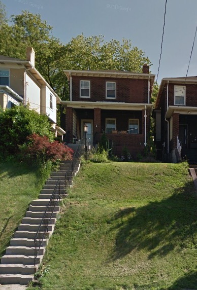

```{r setup, include=FALSE}
knitr::opts_chunk$set(echo = FALSE)
```

## A (short) walk down memory lane...

## Pittsburgh is a great place to have kids...

<div class="centered">

</div>

## And Happy Valley...

<div class="centered">

</div>

## ...a great place to raise them

<div class="centered">

</div>

---

<div class="centered">

</div>

---

<div class="centered">

</div>

---

<div class="centered">

</div>

## The eye never stops moving

<div class="centered">

</div>

## Questions and consequences

- Image stabilization, frames of reference, forward models
- Optic flow parsing, self vs. objects

---

<div class="centered">
<video width="700" height="400" controls>
  <source src="https://nyu.databrary.org/slot/9802/-/asset/11662/download?inline=true" type="video/mp4">
  Your browser does not support the video tag.
</video>

[[@3ec11976-a692-4e8a-901a-ec196b9ead39]](http://dx.doi.org/10.17910/B7101Z)
</div>

---

<div class="centered">
<video width="700" height="400" controls>
  <source src="https://nyu.databrary.org/slot/8227/0,701010/asset/19089/download?inline=true" type="video/mp4">
  Your browser does not support the video tag.
</video>

[[@dac56ec7-587d-4e9a-8bd0-7bc77caa0f75]](http://dx.doi.org/10.17910/B7.123)
</div>

---

<div class="centered">
<video width="700" height="400" controls>
  <source src="https://nyu.databrary.org/slot/7587/5238957,7101101/asset/16149/download?inline=true" type="video/mp4">
  Your browser does not support the video tag.
</video>

[[@2586d67d-3f7a-4892-8b75-493e2d31b7b0]](http://dx.doi.org/10.17910/B7988V)
</div>

---

- What are the statistics of natural visual experiences?
- Do they differ across development?
- How do they shape behavior?
- How do they shape the developing brain?

## Brain imaging is totally tubular

<div class="centered">


<http://imaging.psu.edu>
</div>

## Just make sure to go before...

<div class="centered">

</div>

- Sorry, Jon Cohen. :(

---

<iframe src="http://databrary.org"></iframe>

## Help us build the future...

<iframe src="http://databrary.org/about/jobs.html"></iframe>

## Lessons learned

## CMU ≠

<div class="centered">

</div>

---

<div class="centered">
**The world doesn't seem to know that.**
</div>

## But, Google does...

<div class="centered">

</div>

## Put the emPHAsis on the right sylLABle {.flexbox .vcenter}

<div class="centered">
Car**NE**gie Mellon
</div>

---

<div class="centered">
**The world doesn't know that, either.**
</div>

## Think or thwim mentoring has its virtues

<div class="centered">

</div>

## *This* is 'gradient descent' {.flexbox .vcenter}

<div class="centered">

</div>

## ACT-R does not mean {.flexbox .vcenter .bigger}

<div class="centered">
**A** **C**ognitive **T**heory
</div>

## MacMail 0.9 was good {.bigger}

> - So was Word 5.1a
> - Never upgrade

## Avoid holy wars

- GUI vs. command line
- Mac vs. Windows vs. *nix
- Blue state vs. Red state
- Nativism vs. empiricism
- Python vs. R
- JavaScript vs. a real language

## From simple beginnings...

<iframe src="http://www.cnbc.cmu.edu/graduate-training-mainmenu-66/cnbc-grad-training-program-mainmenu-123"></iframe>

## Psychology is harder than physics {.flexbox .vcenter}

<div class="centered">

</div>

## Don't have physics envy {.flexbox .vcenter}

<div class="centered">

</div>

## CMU ≠ A Typical Psychology Department {.flexbox .vcenter .build}

<div class="centered">
Be thankful for that. I am.
</div>

---

<div class="centered">

</div>

## The Brady Bunch {.flexbox .vcenter}


## The ~~Brady~~ *Baker* Bunch {.flexbox .vcenter}


---

<iframe width="560" height="315" src="https://www.youtube.com/embed/2FnK40KA2LM" frameborder="0" allowfullscreen></iframe>

## The Baker Bunch {.flexbox .vcenter .bigger}

<div class="centered">
**Here's the story of a neural network**</br>
Who was fighting for street cred in the hood.</br>
All the models had their productions.</br>
The network didn't feel good.</br>
</div>

## The Baker Bunch {.flexbox .vcenter .bigger}

<div class="centered">
Here's the story of a neural network</br>
**Who was fighting for street cred in the hood.**</br>
All the models had their productions.</br>
The network didn't feel good.</br>
</div>

## The Baker Bunch {.flexbox .vcenter .bigger}

<div class="centered">
Here's the story of a neural network</br>
Who was fighting for street cred in the hood.</br>
**All the models had their productions.**</br>
The network didn't feel good.</br>
</div>

## The Baker Bunch {.flexbox .vcenter .bigger}

<div class="centered">
Here's the story of a neural network</br>
Who was fighting for street cred in the hood.</br>
All the models had their productions.</br>
**The network didn't feel good.**</br>
</div>

## The Baker Bunch {.flexbox .vcenter .bigger}

<div class="centered">
**Here's the story, of SOARing frameworks**</br>
that were 'splainin' cognition on their own.</br>
Just ACT-Rs in a play for Bobby Klatzky.</br>
But, they were all alone.</br>
</div>

## The Baker Bunch {.flexbox .vcenter .bigger}

<div class="centered">
Here's the story, of SOARing frameworks</br>
**that were 'splainin' cognition on their own.**</br>
Just ACT-Rs in a play for Bobby Klatzky.</br>
But, they were all alone.</br>
</div>

## The Baker Bunch {.flexbox .vcenter .bigger}

<div class="centered">
Here's the story, of SOARing frameworks</br>
that were 'splainin' cognition on their own.</br>
**Just ACT-Rs in a play for Bobby Klatzky.**</br>
But, they were all alone.</br>
</div>

## The Baker Bunch {.flexbox .vcenter .bigger}

<div class="centered">
Here's the story, of SOARing frameworks</br>
that were 'splainin' cognition on their own.</br>
Just ACT-Rs in a play for Bobby Klatzky.</br>
**But, they were all alone.**</br>
</div>


## The Baker Bunch {.flexbox .vcenter .bigger}

<div class="centered">
**'Til the one day when the network reached its threshold.**</br>
And the CPUs ran out of things to crunch.</br>
The geeks saw colleagues as their family.</br>
That's how we all became the Baker Bunch.</br>
</div>

## The Baker Bunch {.flexbox .vcenter .bigger}

<div class="centered">
'Til the one day when the network reached its threshold,</br>
**And the CPUs ran out of things to crunch.**</br>
The geeks saw colleagues as their family.</br>
That's how we all became the Baker Bunch.</br>
</div>

## The Baker Bunch {.flexbox .vcenter .bigger}

<div class="centered">
'Til the one day when the network reached its threshold,</br>
And the CPUs ran out of things to crunch.</br>
**The geeks saw colleagues as their family.**</br>
That's how we all became the Baker Bunch.</br>
</div>

## The Baker Bunch {.flexbox .vcenter .bigger}

<div class="centered">
'Til the one day when the network reached its threshold,</br>
And the CPUs ran out of things to crunch.</br>
The geeks saw colleagues as their family.</br>
**That's how we all became the Baker Bunch.**</br>
</div>

## The Baker Bunch {.flexbox .vcenter .bigger}

<div class="centered">
The Baker Bunch, The Baker Bunch.</br>
That's the way we all became the Baker Bunch.</br>
</div>

## The Baker Bunch {.flexbox .vcenter}


---

<div class="centered">
<http://github.com/rogilmore/cmu-psych-100/></br>
<http://gilmore-lab.github.io/></br>
<http://databrary.org></br>
<http://rick-gilmore.com/>
</div>

---